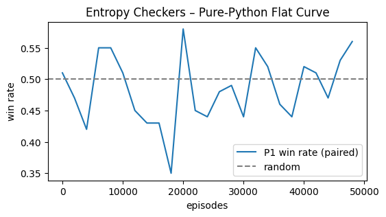

# EC-Flat50Bench: The "Null Model" Benchmark

[](https://colab.research.google.com/github/Rob-McCormack/EC-Flat50Bench/blob/main/notebook/EC_Cancellation_Bench.ipynb)

A reproducible **null-hypothesis benchmark** demonstrating the statistical signature of **Entropy Checkers (EC)**: a deterministic 8×8 game where tabular Q-learning is structurally forced to plateau at a 50% win-rate.

## The Premise: Why This Exists

**Entropy Checkers** is a theoretical variant of checkers designed to break reinforcement learning.

- **The Rules:** Standard checkers, but after **any capture**, the loser chooses a board rewrite (Mutual Removal or Bilateral Swap).
- **The Prediction:** Because the opponent can retroactively invert the value of a move (the "35% Sign-Flip Rate"), no stable learning gradient exists.

## The Benchmark

This repository contains a stochastic baseline script, NOT a full game engine. It generates the statistical pattern that our theory predicts for Entropy Checkers. It is a simplified **null-model** (randomized reward baseline) that reproduces the exact empirical pattern predicted for the full game:

1.  **Flat win-rate ≈ 0.50 ± 0.06** – No upward trend after 50k episodes.
2.  **35% Adversarial Sign-Flip Rate** – The "noise floor" of the system.

**Use this benchmark to calibrate full EC engines.** If your complex agent cannot statistically distinguish itself from this null model, it has hit the **Competence Ceiling**.

## Quick Start

1.  Click the badge above → **Run All**.
2.  Observe that the learning curve flatlines exactly as predicted by the "Adversarial Cancellation" theory.
3.  **Data**: `data/ec_flat_curve.csv` (50,000 episodes).

## Empirical Evidence

_Figure 1: The "Dead Signal." This flatline represents the maximum possible performance in an environment where causal history is adversarially severed._



**CSV:** [ec_flat_curve.csv](data/ec_flat_curve.csv) – (50,000 episodes of flatline convergence).

### The Handicap/Cheating Paradox

To illustrate the severity of the competence ceiling, consider this thought experiment regarding material advantage:

**In Chess**: If a player cheated to start with two extra Queens, they would easily defeat a Grandmaster (or even Stockfish). Material advantage is decisive and compounds.

**In Entropy Checkers**: A player who starts with "God Mode" (extra Kings) sees win-rate improvements of only ~1-2%—barely distinguishable from noise.

**Why?** In EC, material advantage is a structural liability. Each extra piece simply provides the opponent with:

- **Additional targets** for Mutual Removal
- **More coordinates** for Bilateral Swap disruption
- **Increased vulnerability** to adversarial cancellation

The game's physics systematically dampen advantages back to equilibrium. **Even "cheating" fails to overcome the structural friction designed into EC's rules.**

## The Open Question

**Can Optimization Be Defined Here?** We challenge the community to design an agent that outperforms this null model. However, we caution that this may be a **category error**.

Our hypothesis is that:

"_the moment you inject a win-probability or value-function into EC, the experiment stops being about EC and starts being about "EC-plus-your-metric._"

Because the rules allow the opponent to retroactively invalidate the strategic meaning of board states, no metric survives the next entropy choice. Therefore, any "proof" of optimization would testify only to your specific metric, not to the game itself.

The interesting question isn’t "Can AI optimize in EC?" but "Why can’t we define what optimization means here?"

Use this benchmark as the "_Noise Floor._" If your complex agent cannot statistically distinguish itself from this randomized baseline, it suggests you have encountered the Competence Ceiling predicted by our theory.

## Cite This Work

```bibtex
@misc{flat50bench2025,
  author = {McCormack, Rob},
  title  = {EC-Flat50Bench: A Null-Model Benchmark for Adversarial Sign-Flip},
  year   = {2025},
  url    = {https://github.com/Rob-McCormack/EC-Flat50Bench}
}
```

## License

MIT – feel free to fork, cite, or embed.

## Contact

[rob.a.mccormack@gmail.com](mailto:rob.a.mccormack@gmail.com)

---
