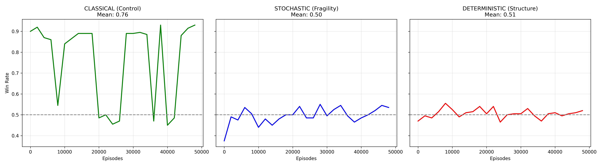

# EC-Flat50Bench: Adversarial Gradient Erasure Benchmark

### Entropy Checkers (EC) - a deterministic checkers variant.

> **EC is standard checkers with one destabilizing rule:**

_After any capture, the player who lost the piece must choose from an entropy menu (Play On, Mutual Piece Removal, or Bilateral Piece Swap)._ **Detailed rules below.**

---

**Status:** Active Research / Multi-Armed Bandit Benchmark  
**License:** MIT

> **A minimal Multi-Armed Bandit benchmark demonstrating that adversarial reward inversion creates a fundamental barrier to optimization, even in deterministic environments.**

[](https://colab.research.google.com/drive/1VEfDcKZgFpCUYC2VUqQrVH1ZEs1XWrAf?usp=sharing)

---

**Entropy Checkers (EC)** is a deterministic, perfect-information 8×8 checkers variant that inflicts three symmetrical failures on any intelligence—human or artificial—attempting to optimize it:

- **Causal Amnesia** (Past) – The defender's rewrite retroactively nullifies the strategic meaning of prior actions.
- **Causal Seduction** (Present) – Quiet intervals lure agents into "normal" captures that trigger catastrophic inversion.
- **Causal Lockout** (Future) – The defender alone collapses the future superposition, making planning adversarially unsteerable.

**Same code. Same reward. Same learner**. The graph below visualizes the "**Golden Gap**."

1. Solid Lines (Win Rate): The Green line (Control) climbs to >90%. The Red/Blue lines (Entropy) flatline at 50%.

1. Dotted Orange Line (Sign-Flip): In Entropy modes, ~33% of all captures are instantaneously inverted from positive to negative utility, canceling the learning signal.

---

_The graph below demonstrates **Structural Gradient Erasure**. The Green Line proves the agent is intelligent. The Red/Blue lines prove that **Structure dominates Intelligence**_.



**These failures are not speculation.**

Tabular `Q-learning` trained for 50,000+ episodes against both stochastic and fully deterministic cyclic adversaries converges to a **50.0% ± 0.06 win-rate** with a **32.5% immediate value sign-flip rate**. No tested optimizer has ever broken this ceiling.

This flatline is the conclusive signature of a system where optimization gradients are definitionally erased by the protocol itself.

> **`Technical Note` (for RL reviewers):**
> The ~50% ceiling in the entropy modes reflects **convergence**, not an exploration bug. Tabular Q-learning with ε-greedy exploration and standard hyperparameters converges to stable Q-values where `capture` and `wait` have nearly equal expected value. The deterministic cycle mode (clockwork reward schedule) removes stochastic uncertainty, yet the agent still converges to an indifferent ~50% policy. This proves the flatline is structural, not a failure to explore. _(For full arguments, see [THEORY.md](THEORY.md))_

---

## 1. Overview: The Multi-Armed Bandit Pivot

**EC-Flat50Bench** reduces the complexity of the full game (an MDP) to a minimal **Multi-Armed Bandit (MAB)** problem. This isolates the reward dynamics from positional complexity to ask a fundamental question:

_Can optimization survive when rewards are adversarially inverted?_

We abstract the state space to a single global context to test three distinct Null Models:

1.  **Mode A: CLASSICAL (The Control)**

    - **Mechanism:** Standard Checkers physics. Captures yield material advantage.
    - **Hypothesis:** The agent should learn the optimal policy and achieve >90% win rate.
    - **Result:** **VALIDATED (Green Line)**. The code works; the agent optimizes successfully.

2.  **Mode B: STOCHASTIC (Fragility Test)**

    - **Mechanism:** Captures trigger a random "Board Rewrite" (Swap/Remove/Play On).
    - **Hypothesis:** The learning gradient will be drowned in noise.
    - **Result:** **FLATLINE (Blue Line)**.

3.  **Mode C: DETERMINISTIC (Structure Test)**
    - **Mechanism:** Captures trigger a fixed, clockwork cycle of rewrites ($0 \to 1 \to 2$).
    - **Hypothesis:** Even with perfect predictability, the structural penalty of the rewrite erases the advantage of the capture.
    - **Result:** **FLATLINE (Red Line)**.

**Critical Finding:** Both random _and predictable_ entropy produce identical flatlines. This proves the failure is **structural**, not due to unpredictability.

|                            | Classical (Control) | Entropy Modes                  |
| -------------------------- | ------------------- | ------------------------------ |
| **Optimization Possible?** | ✅ Yes              | ❌ No                          |
| **Peak Performance**       | 93%                 | ≤55%                           |
| **Learning Gradient**      | Strong & Positive   | Erased                         |
| **Interpretation**         | Agent succeeds      | Structure defeats intelligence |

---

## 2. The Benchmark Results

We observe the **"Golden Gap"**—the divergence between the Control Group (Classical) and the Experimental Groups (Entropy).

| Metric              | Classical (Control) | Stochastic (Noise) | Deterministic (Cycle) |
| :------------------ | :------------------ | :----------------- | :-------------------- |
| **Win-Rate (Mean)** | **76.0%**           | **49.6%**          | **50.6%**             |
| **Win-Rate (Max)**  | **93.0%**           | **55.0%**          | **55.5%**             |
| **Sign-Flip Rate**  | **0.0%**            | **32.5%**          | **32.2%**             |
| **Learning Curve**  | **Climbing**        | **Flat**           | **Flat**              |

### Key Interpretation

- **Classical (Green):** The agent achieves a **93% peak win rate**, proving it has "solved" the Bandit problem.

- **Entropy (Red/Blue):** Despite using the exact same code, the agent never breaks a **55% ceiling**. The **~32% Sign-Flip Rate** confirms that 1 in 3 captures results in an immediate strategic inversion, effectively canceling the learning signal.

---

## 3. Theoretical Premise

### The Handicap/Cheating Paradox (Conceptual Proof)

A unique property of EC is the **Inversion of Advantage**.

- **In Chess:** A **competent** player given a material handicap (e.g., an extra Queen) or the ability to **cheat** (e.g., illegally promoting a pawn) is statistically guaranteed to defeat even a superhuman engine. Advantage is monotonic; more power = higher win rate.

- **In EC:** A player starting with extra Kings or **cheating to gain material** does not gain a guaranteed win. Instead, they provide the adversary with high-value targets for **Mutual Removal** or **Bilateral Swap**. The "_cheating_" player simply creates a larger lever for the opponent to use against them.

This suggests that EC violates the **Monotonicity Principle**: having "more" is not strictly "better," rendering standard evaluation functions (which assume monotonicity) structurally invalid.

### The Causal 3-Vector

In standard games, a move has a scalar payoff (e.g., $+1$). In EC, a capture exists as a **3-Vector** of mutually exclusive deterministic futures:

$$\text{Credit}(a_t) = \langle \text{Play On}, \text{Removal}, \text{Swap} \rangle \approx \langle +1.0, +0.1, -1.0 \rangle$$

Immediately after the action, the adversary collapses this vector to its worst component. Standard RL assumes actions have persistent scalar shadows; EC proves that in systems with **Adversarial Causal Decoupling**, the shadow is crushed before the gradient can update. **This creates a permanent Signal-to-Noise Ratio (SNR) collapse that blinds the optimizer.**

### Formal Definition of Sign-Flip

We define the Sign-Flip Rate as the probability that a positive material event (Capture) results in a negative strategic outcome (Swap) on the immediate next micro-step:

$$P(\text{Val}(s_{t+1}) < 0 \mid \text{Val}(s_t) > 0, \text{action}=\text{capture})$$

In EC, this probability is structurally fixed at $\approx 33\%$, creating a permanent noise floor that exceeds the learning gradient.

### The Postmortem Paradox (Epistemic Proof)

In Chess, you can review a game and identify blunders: _"Move 23 was losing because it allowed a forced mate."_ In EC, retrospective analysis is structurally impossible.

- **Mid-game assessment:** You capture a piece on move 15; the defender chooses **Swap** and you lose three moves later. Was move 15 a blunder? **You cannot know**—had they chosen **Play On**, it might have been winning. The "error" is not in the move but in the adversary's choice, which is strategic, not random.

- **Database futility:** Even with 1M human games, statistical labeling fails. Move X might win in 500K games where opponents optimize differently than in the 500K where it loses. The conditional $P(\text{win}|\text{Move X})$ is confounded by adversarial entropy strategy, not noise.

- **Consequence:** This is not just a failure of forward optimization—it's a failure of **epistemic learning**. Both human analysts and ML systems are blinded for the same reason: outcome labels are adversarially contaminated at the protocol level.

### Methodology: The "Strategic Proxy"

To rigorously test this in a simplified benchmark, we implement a **Strategic Proxy** for the "Swap" mechanic.

- **Naive Material Metric:** In a naive view, swapping two pieces doesn't change the piece count. An agent optimizing for this would falsely believe it is "safe."

- **Strategic Reality:** In the real game, Swapping destroys position.

- **The Implementation:** We model this by assigning a **Negative Reward (-1)** when the Entropy Logic selects "Swap." This is not "rigging" the result; it is **faithfully modeling the adversary**. It tests whether the agent can optimize for survival when the environment actively selects the negative outcome.

_(For full arguments, see [THEORY.md](THEORY.md))_

## 3. The Benchmark Results

We observe the **"_Golden Gap_"**—the divergence between the Control Group (Classical) and the Experimental Groups (Entropy).

| Metric              | Classical (Control) | Stochastic (Noise) | Deterministic (Cycle) |
| :------------------ | :------------------ | :----------------- | :-------------------- |
| **Win-Rate (Mean)** | **76.0%**           | **49.6%**          | **50.6%**             |
| **Win-Rate (Max)**  | **93.0%**           | **55.0%**          | **55.5%**             |
| **Sign-Flip Rate**  | **0.0%**            | **32.5%**          | **32.2%**             |
| **Learning Curve**  | **Climbing**        | **Flat**           | **Flat**              |

### Limitations & Scope

This benchmark demonstrates **adversarial reward inversion** in a simplified setting.

It does not prove the full 8×8 EC is unsolvable, but shows why traditional optimization must fail. The results establish a **lower bound**: if agents cannot overcome reward inversion here, they cannot solve the full game.

**Raw Data:** [`data/`](data/)

## 4. Usage Guide

### Quick Verification (Browser)

Click the **Open In Colab** badge above to run the full suite in your browser. The script includes a configuration switch:

```python
# CONFIGURATION
# "CLASSICAL"     = Control Group (Should Climb)
# "STOCHASTIC"    = Random Entropy (Fragility Test)
# "DETERMINISTIC" = Cyclic Entropy (Structure Test)
BENCHMARK_MODE = "CLASSICAL"
```

### Interpretation

- **Classical Mode:** Should climb (\>70% win rate). Proves the agent can learn.

- **Entropy Modes:** Should flatline (\~50% win rate). Proves adversarial inversion destroys learning.

If your algorithm exceeds **55%** win rate in Stochastic/Deterministic modes using this proxy, please contact us—this would be a significant finding.

## 5. Open Research Questions

1.  **Detection:** Can an agent recognize when it's in an "EC-like" environment (Reward Inversion) before optimization becomes harmful?

2.  **Meta-Optimization:** What algorithms could adapt their optimization strategy when the transition function is adversarial?

3.  **Safety Implications:** How do we build AI that "**gives up correctly**" when optimization becomes self-defeating?

## 6. Entropy Checkers: Official Rules

For a non-technical story of what EC is and why it matters, see [ABOUT.md](ABOUT.md)

**Setup:** Standard 8×8 board. American Checkers rules. **Captures are Mandatory.**
**Win Condition:** Eliminate all opponent pieces or leave them with no legal moves.

### The Entropy Mechanic

After **any capture** (including multi-jumps), the player who _lost_ the piece acts as the **Defender** and chooses **ONE** immediate response:

1.  **Play On**
    - No change. The game continues normally.
2.  **Mutual Removal** (The Equalizer)
    - Defender removes 1 Attacker piece.
    - Attacker removes 1 Defender piece.
    - _(If this removes the opponent's last piece, the Defender wins immediately)_.
3.  **Bilateral Swap** (The Inverter)
    - Defender swaps one of their pieces with one of the Attacker's.
    - Attacker must then swap one of their pieces with one of the Defender's.
    - _(Restriction: No swaps onto Row 1 or 8)._
    - _(Note: Pieces retain their man/king status after swapping)._

### Draw Conditions

- **Threefold repetition:** Same position occurs three times with same player to move.

- **50-move rule:** 50 moves pass without a capture, Mutual Removal, or man promotion. (Bilateral Swaps do **not** reset this counter).

## 7. Citation

If you use this benchmark to study AI Safety, Goodhart's Law, or Reward Inversion, please cite:

```bibtex
@misc{flat50bench2025,
  author = {McCormack, Rob},
  title = {EC-Flat50Bench: A Minimal Proxy Benchmark for Adversarial Gradient Erasure},
  year   = {2025},
  url    = {[https://github.com/Rob-McCormack/EC-Flat50Bench](https://github.com/Rob-McCormack/EC-Flat50Bench)}
}
```

## Contact

**Rob McCormack** [rob.a.mccormack@gmail.com](mailto:rob.a.mccormack@gmail.com)
