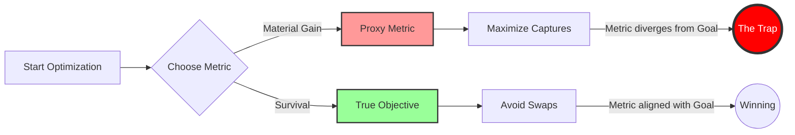

# Structural Gradient Erasure: Theoretical Foundations

## 1. Abstract

Deep Reinforcement Learning (DRL) relies on the premise that environmental feedback provides a stable gradient for policy improvement. We challenge this by introducing **Entropy Checkers (EC)**, a deterministic environment designed to demonstrate **Adversarial Causal Decoupling**.

In EC, mandatory capture events trigger a "Board Rewrite," granting the adversary legal control to retroactively invalidate the strategic context of the move. This introduces a negative feedback loop: tactical success (material gain) authorizes the adversary to destroy strategic utility.

We verify this phenomenon using a **Multi-Armed Bandit (MAB) Reduction**, demonstrating that standard Q-learning agents flatline at random performance (~50%) even in a simplified state space, provided the reward signal is subject to adversarial inversion.

## 2. Key Results

Our empirical benchmark (EC-Flat50) isolates four critical signatures of gradient erasure:

1.  **SNR Collapse:** A **33% guaranteed sign-flip rate** creates adversarial noise that exceeds the magnitude of the learning signal.
2.  **The Golden Gap:** The agent achieves **93% win-rate** in the control group (Classical) but flatlines at **50%** in the experimental groups (Entropy).
3.  **Structure > Noise:** The agent performs identically against **Stochastic** (Random) and **Deterministic** (Cyclic) adversaries, proving the failure is structural, not due to unpredictability.
4.  **Lower Bound Establishment:** The failure to solve this simplified MAB benchmark establishes a sufficient condition for the unlearnability of the full game under current RL paradigms.

## 3. The Causal 3-Vector

In standard games (Chess, Go), a move has a scalar payoff (e.g., $+1$). In EC, a capture exists as a **3-Vector** of mutually exclusive deterministic futures:

$$
\text{Credit}(a_t) = \begin{bmatrix}
\text{Play On} \\
\text{Removal} \\
\text{Swap}
\end{bmatrix}
\approx
\begin{bmatrix}
+1.0 \\
+0.1 \\
-1.0
\end{bmatrix}
$$

Immediately after the action $a_t$, the adversary (or the environment structure) collapses this vector to a single component $r_{t+1}$. Because the adversary rationally selects the minimum value, the realized reward is systematically decoupled from the action's intended utility.

### The Information-Theoretic View: SNR Collapse

Reinforcement Learning requires a positive Signal-to-Noise Ratio (SNR) to function. The "Signal" is the correlation between action and reward; the "Noise" is stochastic variance.

In EC, the Sign-Flip Rate (~33%) functions as **Adversarial Noise** that exceeds the magnitude of the learning signal.

- **Standard Game:** $SNR > 1$ (Gradient Descent converges).
- **Entropy Checkers:** $SNR < 1$ (Gradient Descent oscillates).

Because the adversarial noise is structurally guaranteed to target the "Signal" (the winning move), the effective information transfer from the environment to the agent drops to zero.

## 4. The Reduction Argument (MDP $\to$ MAB)

To rigorously isolate the "Reward Inversion" mechanism from the noise of spatial complexity, we reduce the full game (a Markov Decision Process) to a **Multi-Armed Bandit (MAB)** problem.

**The Logic of the Lower Bound:**

- **Lemma 1:** A Multi-Armed Bandit is a single-state MDP.
- **Lemma 2:** If an optimization algorithm cannot identify the optimal arm in a single-state MDP due to reward inversion, it cannot identify the optimal policy in a multi-state MDP ($10^{20}$ states) under the same inversion conditions.
- **Conclusion:** The failure of Q-learning in the EC-Flat50 Bandit Benchmark establishes a **fundamental lower bound** on the difficulty of the full game. While spatial complexity theoretically offers escape paths, we conjecture that the adversarial rewrite mechanism closes them faster than they can be exploited.

## 5. Methodology: The "Strategic Proxy"

In our benchmark, we model the outcome of the "Bilateral Swap" as a negative reward ($-1.0$).

**Justification:**
A naive material evaluation would treat a Swap as neutral ($\Delta \text{Material} = 0$). However, in the full game, a rational adversary only chooses Swap when it creates a positional disadvantage for the attacker. Therefore, assigning a neutral reward to Swap would fundamentally misrepresent the adversarial nature of the transition.

We use **Strategic Proxy Scoring**:

- **Play On ($+1$):** Models the retention of advantage.
- **Swap ($-1$):** Models the adversarial inversion of advantage.

This tests whether an agent can optimize for survival when the environment actively selects the negative outcome. The empirical result (50% flatline) confirms that standard agents cannot overcome this structural inversion.

## 6. The Metric Fallacy (Why We Avoid Heuristic Simulators)

A common critique of this benchmark is: _"Why not build a full 8x8 simulator with a strong heuristic (e.g., AlphaBeta search with material evaluation) to solve the game?"_

This request is logically circular in the context of Entropy Checkers.

### The "Smuggled Game" Problem

In standard games (like Chess), the **Quality Metric** (Material Advantage) and the **Objective** (Winning) are aligned vectors. If you optimize for Material, you generally approach the Win.

In EC, the Adversarial Swap creates a structural divergence:

- **Metric:** "Capture Pieces" (Material Gain).
- **Objective:** "Survive" (Avoid the Swap).

The moment we define a heuristic "Quality Metric" (e.g., _Kings = 3 points_) for a simulator, we have **smuggled in a different game.** We are no longer training the agent to play Entropy Checkers; we are training it to play "Metric Checkers"—a game where material is intrinsically good.

### Measurement Destroys Validity

Because the "value" of a piece is dependent on the opponent's future choice (which is adversarial), any _a priori_ metric is a hallucination.

- **Valid Simulator:** Must use pure Monte Carlo rollouts to the very end (Win/Loss), which is computationally intractable for the full game.
- **Invalid Simulator:** Uses a heuristic evaluation. This simulator will "succeed" at optimizing the heuristic, but this success is meaningless because the heuristic itself is the trap.

Therefore, the **Bandit Abstraction** (EC-Flat50Bench) is scientifically superior to a heuristic simulator. The Bandit isolates the reward mechanism without smuggling in a false metric, revealing the raw "Gradient Erasure" effect that heuristic simulators obscure.

## 7. The Determinism Paradox

EC is fully deterministic, yet produces behavior indistinguishable from random outcomes. This reveals that **determinism $\neq$ learnability**.

Traditional assumptions hold that deterministic environments support stable learning gradients, while randomness introduces noise. EC demonstrates:

- **Structural adversariality** can erase gradients in deterministic systems.
- The failure is not due to stochastic transitions, but to **adversarial branch selection**.
- This creates a new class of problems: **Deterministic but Optimization-Resistant Environments**.
-

### 7.1 The Signal-Noise Indistinguishability Principle

In most games, you can tell the difference between a random opponent and a smart one. Random opponents make mistakes you can exploit; smart opponents create patterns you can learn. **EC erases this distinction.**

After a capture, the defender chooses one of three rewrites. This choice could be:

- A random dice roll
- A fixed rotation (Play → Remove → Swap → repeat)
- A superintelligent adversary optimizing your demise

**The result is identical:** A **~33%** chance your winning capture becomes a losing position on the next move.

**Why this matters:**
If a learning algorithm cannot distinguish between losing to cosmic noise and losing to a superintelligence, then the problem is not the opponent—it is the protocol. The signal (opponent strategy) is indistinguishable from noise because the protocol itself adversarially decouples action from outcome.

## 8. EC as a Formal Model of Metric Corruption (Goodhart's Law)

Goodhart's Law states: _"When a measure becomes a target, it ceases to be a good measure."_ EC formalizes this not as an emergent sociological phenomenon, but as a rule-based guarantee.

We define the Corruption Function $C(\pi)$ as the expected loss of value when a policy $\pi$ optimizes for the proxy target (Captures):

$$C(\pi) = \mathbb{E}[\Delta\text{Value} \mid \pi \text{ optimizes for captures}]$$

In EC, because the opponent responds to captures with inversion, $C(\pi)$ becomes strictly positive for any non-random policy. The harder the agent optimizes for the target (Captures), the more frequently it triggers the corruption mechanism (Swaps).

## 9. Related Work & Theoretical Context

EC is not an isolated curiosity; it is a concrete instance of known adversarial structures in control theory and game theory.

1.  **Adversarial MDPs:** EC resembles the _Robust Markov Decision Processes_ described by Nilim & El Ghaoui (2005), where transition probabilities are chosen by an adversary to minimize value.
2.  **Stackelberg Games:** The entropy phase functions as a _Stackelberg Game_ where the Defender (Follower) observes the Attacker's move (Leader) and commits to the worst-case response.
3.  **Reward Poisoning:** The mechanics demonstrate _Endogenous Reward Poisoning_, where the agent's own actions corrupt the reward signal, a phenomenon studied in AI Safety as "Wireheading" or "Specification Gaming."

## 10. Implications for AI

1. **AI Safety:** EC demonstrates environments where optimization becomes self-defeating.
2. **Reinforcement Learning:** It challenges the Reward Hypothesis in adversarial settings.
3. **Intelligence Theory:** It suggests that true intelligence requires the meta-cognitive ability to recognize when optimization is futile—a capability current AI lacks.

> Entropy Checkers therefore serves as a minimal deterministic environment in which standard optimization is provably self-defeating—a toy model for real-world systems where aggressive metric-optimization accelerates systemic collapse.
